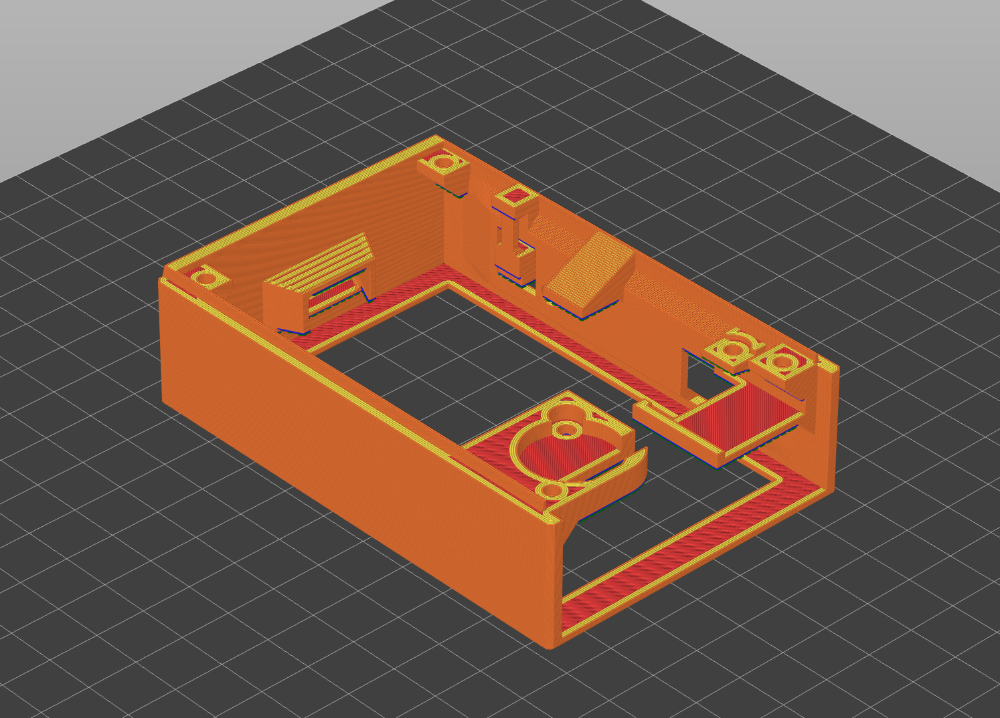
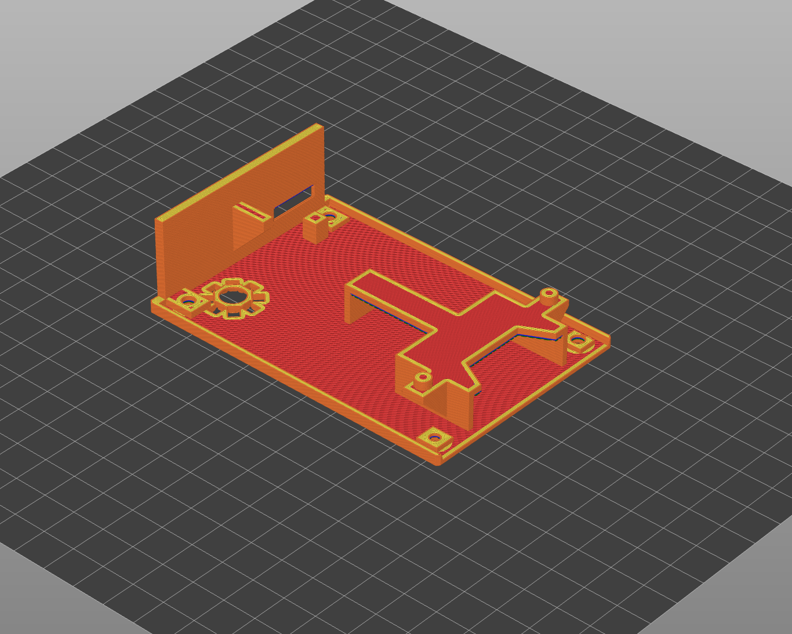
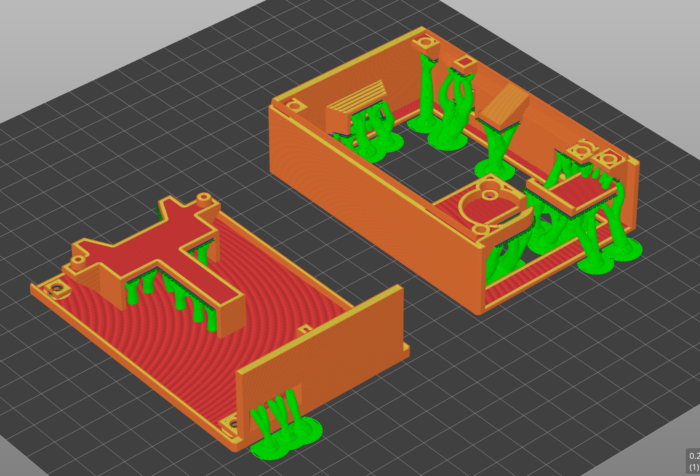

# Case design

3D-printed enclosure for the OTP gadget. Two parts (top and bottom) screwed together, designed in Fusion 360.

## What's in this folder

All files below ship publicly under CC BY-SA 4.0. The project is fully open source - nothing here is paywalled.

- [`README.md`](README.md) - this file.
- [`slicer-settings.md`](slicer-settings.md) - the slicer settings used to print the case. Useful for anyone slicing the supplied `.3mf` files, or designing their own enclosure with similar tolerances.
- [`previews/case-top-preview.png`](previews/case-top-preview.png) - screenshot preview of the top shell.
- [`previews/case-bottom-preview.png`](previews/case-bottom-preview.png) - screenshot preview of the bottom shell.
- [`previews/case-slice-orientation.png`](previews/case-slice-orientation.png) - PrusaSlicer plate/orientation preview.
- `Case bottom.3mf` - printable bottom shell.
- `Case top.3mf` - printable top shell.
- `Case-slice-file.3mf` - pre-arranged slicer project file (a convenience: opens both shells in PrusaSlicer with the orientation/plate layout already set).
- `Case.f3z` - Fusion 360 archive (parametric source). Open this if you want to edit cutouts to fit substituted parts.
- `Case.step` - neutral CAD interchange (STEP). Same model as `Case.f3z`, but openable in FreeCAD, Onshape, SolidWorks, etc. Loses Fusion's parametric history.

## Preview

## Want to support the project?

The CAD is free. If it's useful to you, you can chip in via [GitHub Sponsors](https://github.com/sponsors/matrix-mole). Donations help fund parts, testing, and an eventual EEA-compliant built-unit run via the reservation model.
